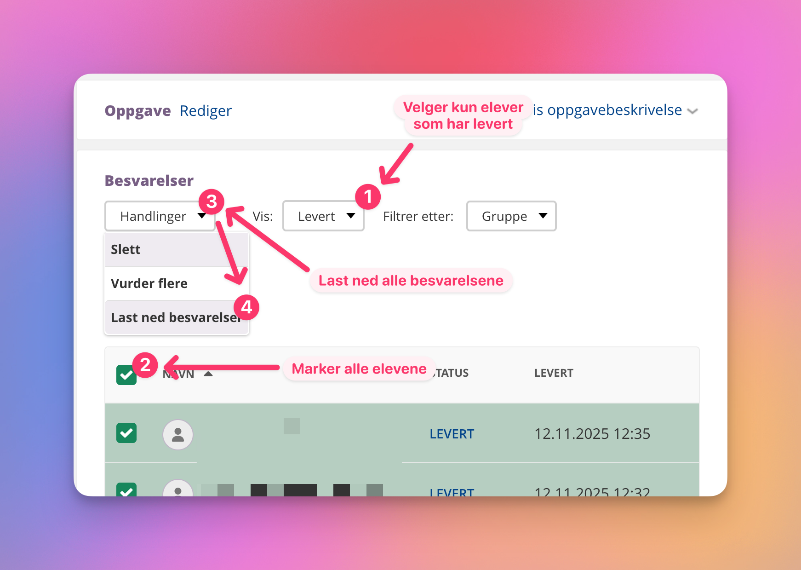

# Skriv ut dokumenter automatisk

## Hensikt

Dette programmet er laget for å gjøre det enkelt for lærere å skrive ut alle elevbesvarelser fra itslearning på én gang. I stedet for å åpne og skrive ut hver besvarelse manuelt, kan du bruke dette programmet til å skrive ut alt automatisk. Programmet legger automatisk til navn på eleven i toppteksten og sidetall i bunnteksten på dokumentene.

## Hva programmet gjør

Dette programmet skriver ut alle dokumenter og bilder i en mappe (eller zip-fil) og alle undermapper automatisk. Programmet støtter:
- Word-filer (.docx)
- PDF-filer (.pdf)
- HTML-filer (.html, .htm)
- Bildefiler (.jpg, .jpeg, .png, .gif, .bmp)
- Tekstfiler (.txt)

**Viktig:** Originaldokumentene dine endres IKKE. Programmet legger kun til følgende på utskriften:
- **Mappenavn** øverst (slik at du vet hvilken mappe dokumentet kom fra)
- **Sidenummer** nederst (format: "Side 1 av 5")

## Hvordan bruke programmet

### Steg 0: Last ned programmet

Last ned `print.ps1` fra GitHub:
- **[Last ned print.ps1](https://raw.githubusercontent.com/stalegjelsten/print-word-files/main/print.ps1)** (høyreklikk og velg "Lagre lenke som..." eller "Save link as...")

Lagre filen et sted på datamaskinen din (for eksempel på Skrivebordet).

### Steg 1: Last ned besvarelser fra itslearning

Logg inn på itslearning og gå til oppgaven du vil skrive ut besvarelser fra



1. Vis kun elevene som har levert oppgaven ved å velge **Vis:** **Levert**
2. **Merk alle elevene** du vil skrive ut besvarelser for (huk av øverst for å velge alle)
3. Klikk på **Handlinger** 
4. **"Last ned besvarelser"** 
5. En zip-fil lastes ned til datamaskinen din (vanligvis i Nedlastinger-mappen)

### Steg 2: Kjør utskriftsprogrammet

1. Høyreklikk på `print.ps1` og velg **"Kjør med PowerShell"** eller **"Run with PowerShell"**
2. Et vindu åpnes. Les informasjonen som vises
3. Det åpnes automatisk et vindu hvor du kan velge enten:
   - **Zip-filen** du lastet ned fra itslearning (anbefalt)
   - **En mappe** som inneholder dokumenter
4. Velg filen/mappen og klikk OK
5. Programmet skriver nå ut alle dokumenter og bilder
6. Når det er ferdig, trykk Enter for å lukke vinduet

## Krav

For at programmet skal fungere optimalt trenger du:
- **Microsoft Word** - For å skrive ut Word-dokumenter og HTML-filer
- **Adobe Acrobat Reader DC** - For å skrive ut PDF-filer

Hvis du ikke har disse programmene installert, vil programmet spørre om du vil fortsette uten støtte for disse filtypene.

## Endre innstillinger

Du kan tilpasse programmet ved å åpne `print.ps1` i Notisblokk og endre disse linjene øverst i filen:

- **Linje 8** (`$CONFIG_MARGIN_CM`): Endre sidemarger i centimeter (standard: 2.0 cm)
- **Linje 9** (`$CONFIG_IMAGE_WIDTH_CM`): Endre maksimal bildebredde i centimeter (standard: 17.0 cm)
- **Linje 10** (`$CONFIG_PRINTER`): Endre hvilken printer som skal brukes

**Standard printer er:** `\\TDCSOM30\Sikker_UtskriftCS`

## Hva gjør programmet?

- **Word-dokumenter:** Programmet legger til mappenavnet øverst på hver side og sidenummerering nederst ("Side 1 av 5")
- **HTML-filer:** Programmet legger til mappenavnet øverst på hver side og sidenummerering nederst
- **PDF-filer:** Skrives ut som de er (uten endringer, siden PDF-filer er vanskeligere å endre)
- **Bilder og tekstfiler:** Programmet lager en midlertidig HTML-fil som viser alle bildene og tekstene fra hver mappe samlet, og skriver så ut denne med mappenavn og sidenummerering. Når utskriften er ferdig, slettes den midlertidige filen automatisk

## Feilsøking

**Hvis du får feilmelding om "execution policy" når du prøver å kjøre skriptet:**

Dette betyr at datamaskinen din blokkerer PowerShell-skript av sikkerhetsgrunner. Slik fikser du det:

1. Høyreklikk på Start-knappen (nederst til venstre på skjermen)
2. Velg "Windows PowerShell (administrator)" eller "Terminal (administrator)"
3. Når det åpner seg et vindu med hvit eller blå tekst, skriv inn følgende og trykk Enter:
   ```
   Set-ExecutionPolicy -ExecutionPolicy RemoteSigned -Scope CurrentUser
   ```
4. Skriv `J` og trykk Enter når du får spørsmål
5. Du kan nå lukke dette vinduet og prøve å kjøre `print.ps1` på nytt

*Dette trenger du bare å gjøre én gang på datamaskinen din*

**Hvis PDF-filer ikke skrives ut:**
- Installer Adobe Acrobat Reader DC (gratis nedlasting fra Adobe)

**Hvis Word- eller HTML-filer ikke skrives ut:**
- Kontroller at Microsoft Word er installert på datamaskinen
